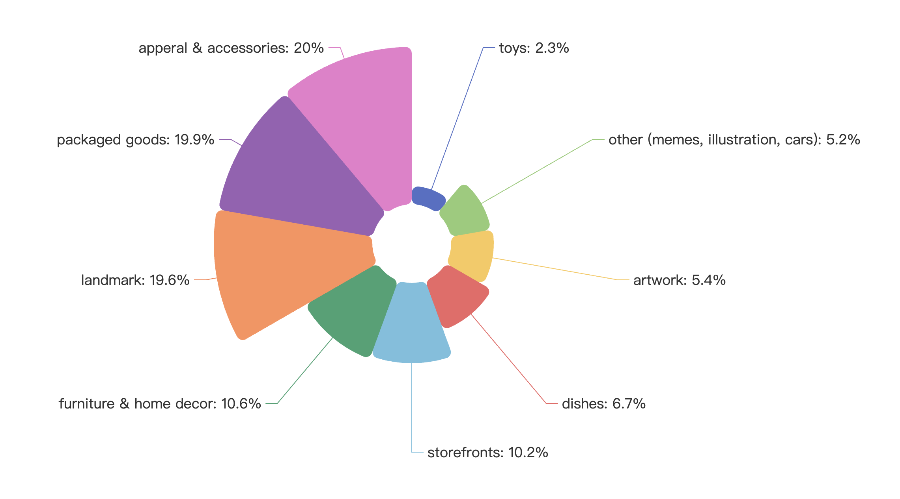
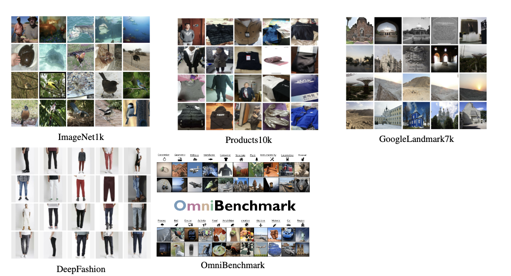
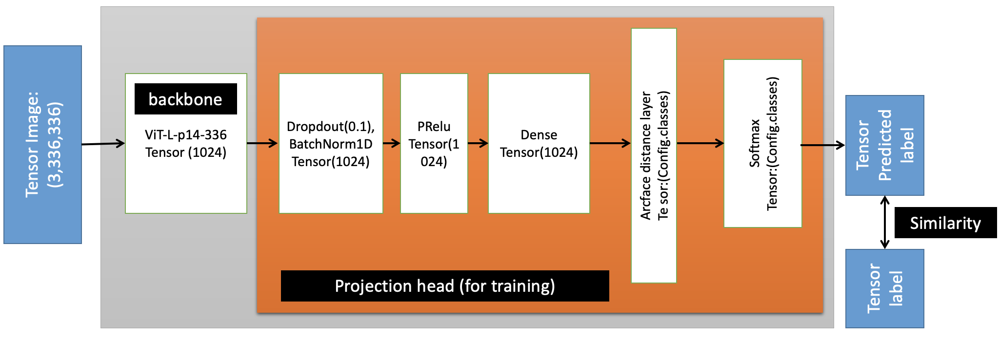

# Google Universal Image Embedding


Image representations are a critical building block of computer vision applications. Traditionally, research on image embedding learning has been conducted with a focus on per-domain models. Generally, papers propose generic embedding learning techniques which are applied to different domains separately, rather than developing generic embedding models which could be applied to all domains combined.

In this competition, the developed models are expected to retrieve relevant database images to a given query image (ie, the model should retrieve database images containing the same object as the query). The images in our dataset comprise a variety of object types, such as apparel, artwork, landmarks, furniture, packaged goods, among others.

## Getting Started
Run the ```google_embedding_Train.ipynb``` under Colab Tpu enviroment.
## Data collection

Since the kaggle doesn't provide any training datasets, and it just gives a description about the distribution of the testing datasets which is shown in .
Based on the distribution, some players collected the relative datasets such as the Imagenet1k, Deepfashion, Products10k, Google-landmark and Omnibenchmark and then upload them to the kaggle website publicly. Since the total dataset is so huge ($21$G), I transformed the datasets into tfrecord format file (simple format for storing a sequence of binary records), which is to
make use of the TPU in Colab to train our model.
<!-- list -->
* Imagenet1k10 (50048, 3, 336, 336) A subset of full Imagenet21k dataset which contains some images relating to cars and artwork with total 1000 classes.
* Products10k11: (141952, 3, 336, 336) A Large Scale Product Recognition Dataset which is a human-labeled products image dataset proposed by JD company cover-ing varieties of categories including Fashion, packaged goods, food, household commodities,etc with total 9691
classes label.
* Mini-Googlelandmark12: (349184, 3, 336, 336) A subset of full Google Landmarks Dataset v2 which has over 5 million images of more than 200 thousand different landmarks. The sub contains some images relating to landmarks with total 7000 classes that for each class has more than 10 images
* Mini Fashion Product Images Dataset13: (52736, 3, 336, 336) A small version of Fashion Product Images Dataset which contains 44k products with multiple category labels, descriptions and high-res images relating to apparel&accessories items with total 7981 classes.
* Omnibenchmark14: (385354, 3, 336, 336) A diverse (21 semantic realm-wise datasets) and concise (realm-wise datasets have no concepts overlapping) benchmark for evaluating pre-trained model generalization across semantic super-concepts/realms, e.g. across mammals to aircraft with total 7k classes.

All dataset are available on the my website. The link is [here](https://console.cloud.google.com/storage/browser/wenxuanye;tab=objects?project=magnetic-icon-363722&pageState=(%22StorageObjectListTable%22:(%22f%22:%22%255B%255D%22))&prefix=&forceOnObjectsSortingFiltering=false).
<!-- show img -->

## Methodology

As shown in below image, the first part is to use pretrained ViT (on ImageNet21k) as backbone and freeze all the layers in this backbone model. The second part is the projection head that we adjust a lot, which will be trained using our collective datasets. The critical part of the projection layer is that we add one Arcface layer between the dense layer and the Softmax layer and achieve the best performance in our experiments. The Arcface layer is to maximize the distance between the different classes and minimize the distance between the same classes. The loss function is the cross entropy loss function. The optimizer is Adam optimizer with learning rate 0.0001 and weight decay 0.0001. 



## Results

During the training, every epoch costs about 3-5 hours to complete and the final ranking is 78/1022

